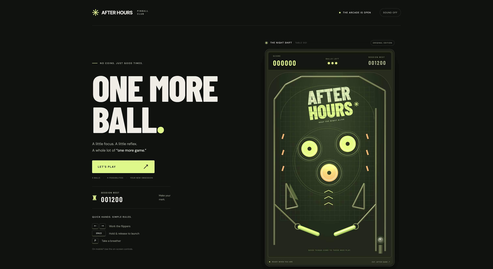

# After Hours — Pinball Club

A browser-based pinball game built with HTML, CSS, JavaScript, and Three.js. Includes a home screen, a 3D-rendered table, keyboard and touch controls, optional synthesized sound, pause/resume, and a session high score.



## Run locally

Install **Node.js 20.19+ or 22.12+** and npm. On macOS with Homebrew:

```sh
brew install node
```

From this project directory:

```sh
npm install
npm run dev
```

Open the local URL printed by Vite (normally **http://localhost:5173**). Click **LET’S PLAY** to begin. Use a modern browser with WebGL enabled. If accessing the game from your phone, connect to the same Wi-Fi network and use the Network URL printed by Vite.

## Controls

| Action | Keyboard | Touch / mouse |
| --- | --- | --- |
| Left flipper | Left arrow or A | Hold LEFT FLIPPER |
| Right flipper | Right arrow or D | Hold RIGHT FLIPPER |
| Launch ball | Hold Space, then release | Hold HOLD TO LAUNCH, then release |
| Pause / resume | P or Escape | PAUSE / KEEP PLAYING |
| Sound | — | SOUND OFF / SOUND ON |

Charge the plunger for up to one second to increase launch power. Each bumper hit earns **100 points**. Each game starts with **three balls**; a ball draining off the bottom costs one life. After the third lost ball, the game ends and shows your final score. Select **PLAY AGAIN** to start a fresh game.

The session best is stored in `sessionStorage`: it survives restarts and refreshes in the same browser tab, and normally resets when that tab is closed. If browser storage is unavailable, the record still works until the page is refreshed. The game automatically pauses when you switch tabs or windows. Returning home ends the current game.

## Production build

```sh
npm run build
npm run preview
```

Deploy the generated `dist/` directory to any static web host. Three.js is bundled locally; Google Fonts are optional and fall back to system fonts if unavailable.

## CI/CD

The GitHub Actions workflow in `.github/workflows/ci-cd.yml` runs on every branch push, pull requests targeting `main`, and manual runs. It uses Node.js 22, installs locked dependencies with `npm ci`, runs the physics tests, and builds the game. Failed tests or builds block deployment.

Successful pushes to `main` automatically deploy the tested build to GitHub Pages. Manual runs also deploy when `main` is selected. Other branches and pull requests only run checks. The Pages build uses relative asset URLs (`npm run build -- --base=./`) so the game works under the repository's `/pinball-game/` path and on a custom domain.

To enable deployment:

1. In the GitHub repository, open **Settings → Pages** and choose **GitHub Actions** as the build and deployment source.
2. Merge the workflow into `main`. The push starts the first deployment; later deployments run automatically after successful checks.
3. Find the published URL in the **Deploy to GitHub Pages** job or **Settings → Pages**. With the default domain, it is `https://jensonchoi.github.io/pinball-game/`.

No additional deployment secrets are needed: the deployment job uses GitHub's built-in token with Pages and OpenID Connect permissions. To require passing CI before merging, configure a branch protection rule or ruleset for `main` that requires the **Test and build** check.

## Tests

```sh
npm test
```

Tests cover ball launching, bumper scoring, pause behavior, and the complete three-life game-over cycle. The physics uses a fixed timestep with circle/segment collision detection, independent of rendering.

## Files

- `index.html` — home page and game interface
- `src/style.css` — responsive arcade styling
- `src/main.js` — Three.js table, input, audio, and session record
- `src/physics.js` — ball simulation and game rules
- `test/physics.test.js` — game-rule regression tests
